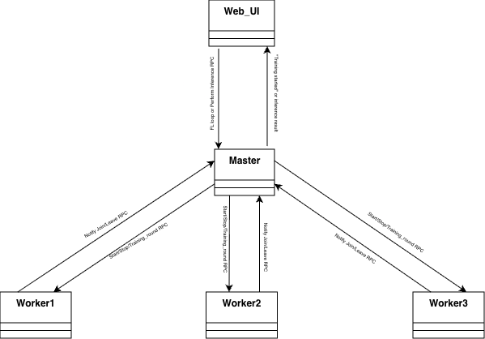
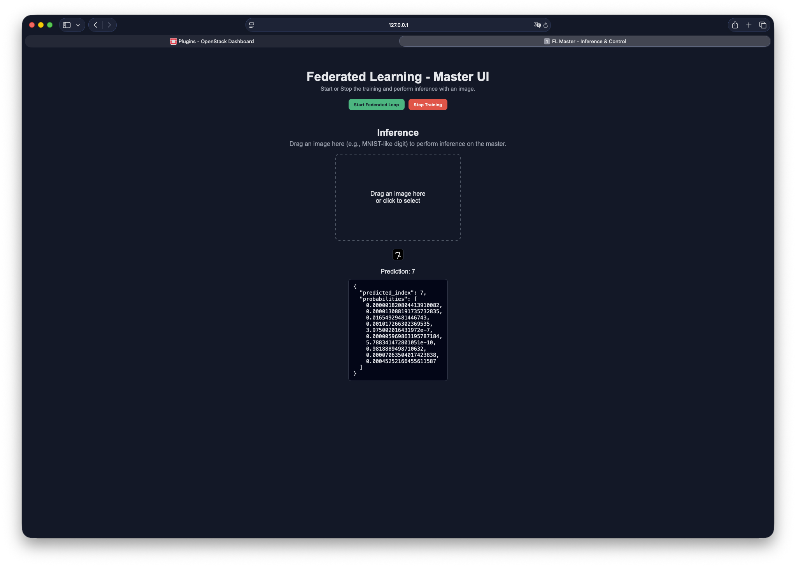

# Federated-Learning-using-Stack4Things
## Introduction
This repository contains code for implementing **Federated Learning** using **Stack4Things**, a framework designed to facilitate the development of federated learning applications. The code is structured to allow for easy integration and experimentation with different federated learning algorithms and models.
The current implementation uses the MNIST dataset for training a simple neural network model, using the Federated approach.
Here you can find two versions: the first being with the data sent in cleartext, the second being with the data encrypted using the *Digital Envelope* and the *Digital Signature* techniques.

## Implementation Details
The implementation of the communication is done using the Stack4Things framework, which provides a set of tools to create and manage WoT devices. The devices are implemented using Python and the Crossbar.io framework, which allows for easy integration with WAMP.
This implementation is a derivation of the Stack4Things framework, found in this repository: <a href="https://github.com/MDSLab/Stack4Things_DockerCompose_deployment">Stack4Things_DockerCompose_deployment</a>.
Some modification were made to the original Docker compose file, in order to add the necessary components for the communication.
In particular, the following components were added:
    - A **Python Slim** container, whose purpose is exposing a web server which provides a **Web user interface** to interact with the system.
    - Three **Lightning Rod** containers, which are used to simulate the devices.
In the next sections, the implementation of the communication will be described in detail, focusing on the differences between the clear and secure communication.
The imagined scenario is composed by:

- A **Web UI**, which can be used to interact with the devices.

- Three **Lightning Rod** devices named **Worker**, which expose four differents RPCs:
    - **start_training**: which is called by the **Master** board to notify that a training round will start soon.
    - **stop_training**: which is called by the **Master** board to notify that the training phase has ended.
    - **train_round**: which is used to start a new training round on the local dataset.
    - **leave_session**: which is used to leave the session and stop the training.

- One last **Lightning Rod** device named **Master**, which exposes five RPCs.
    - **notify_join**: used by each **Worker** to notify the **Master** that it is ready to start the training.
    - **notify_leave**: used by each **Worker** to notify the **Master** that it is leaving the session.
    - **stop_training**: Called via the **Web UI** to stop the training phase.
    - **perform_inference**: Called via the **Web UI** to perform an inference on the model.
    - **federated_loop**: Called via the **Web UI** to start the federated learning loop.

Here is a diagram representing the architecture of the system:



&nbsp;

The compose deployment has been tested in multiple environments: MacOS (ARM), Windows (x86-64), Linux (ARM and x86-64).
In all of the above mentioned environments the deployment worked as intended.

## Usage

### Deployment

To use the code, simply clone the repository and navigate to the directory containing the `docker-compose.yml` file.
Then, run the following command to start the deployment:
```bash
docker-compose up -d
```
This will start all the necessary containers and services.
### Stack4Things platform

In order to make the system work, it is necessary to register the **Lightning-rod** boards in the **Stack4Things** platform, like shown in the original implementation linked above. In order to access the different **LR boards**, you should visit the loopback address of your machine, at port **1474**, **1475**, **1476** and **1477** respectively.
Once you have registered the boards, you should be able to see them in the **Stack4Things** platform dashboard and, thus, you will be able to upload the plugins to the boards.
You should upload the **WAMP_FLMaster.py** (or its secure version) to one **Master** board, and the **WAMP_FLWorker.py** (or its secure version) to each of the three **Worker** boards. Both the plugins will be analyzed in the next sections.
Please note that you should use either both the "*unsecure*" or the "*secure*" versions of the plugins, in order to avoid incompatibility issues.
It is also suggested to start the **Master** board first, and then the three **Worker** boards, in order to avoid connection issues.
### Web User Interface

To access the Web UI, simply navigate to `http://localhost:4053` in any web browser.
Here is a screenshot of the Web UI:



From here, you can start the federated learning loop, perform inference on the model, and monitor the training process.

## Plugins Analysis

Here follows the analysis of the main parts of the plugins used in this implementation. The extracted code snippets are from the **unsecure** versions of the plugins,as the **security features** will be later discussed.

### WAMP_FLMaster.py/WAMP_Secure_FLMaster.py

This plugin is responsible for managing the federated learning process from the **Master** board's perspective. It exposes the necessary RPCs to interact with the **Worker** boards and orchestrates the training rounds.
The RPC responsible for starting the federated learning loop is `federated_loop`, which is called via the Web UI. This RPC coordinates the training rounds by calling the `start_training` and `train_round` RPCs on each **Worker** board, and aggregating the model updates received from them.

```python

LOG = logging.getLogger(__name__)
board_name = socket.gethostname()
LOG.info(f"[WAMP] Board name: {board_name}")
workers = set()

def bytes_to_model(model, model_bytes: bytes):
    [...]
    
def model_to_bytes(model):
     [...]

def fedavg(state_dicts, ns):
     [...]


def perform_inference_routine(model, image):
     [...]


class Net(nn.Module):
     [...]
    


class Worker(Plugin.Plugin):
    def __init__(self, uuid, name, q_result=None, params=None):
        super(Worker, self).__init__(uuid, name, q_result, params)


    def run(self):
        def start_wamp():
                ssl_ctx = ssl._create_unverified_context()

                component = Component(
                    transports=[
                        {
                            "type": "websocket",
                            "url": "wss://crossbar:8181/ws",
                            "endpoint": {
                                "type": "tcp",
                                "host": "crossbar",
                                "port": 8181,
                                "tls": ssl_ctx
                            },
                            "serializers": ["json", "msgpack"]
                        }
                    ],
                    realm="s4t"
                )
            
                @component.on_join
                async def onJoin(session, details):
                    LOG.info(f"[WAMP] Session joined as {board_name}")
                    LOG.info("[WAMP] RPCs registered: federated_loop, stop_training, notify_join, notify_leave, perform_inference")
                    session.stop_train=False
                    session.running=False
                    session.model_ready = Path("/opt/models/global_model.pth").exists() # True if the model already exists

                    async def notify_join(*args, **kwargs):
                        wrk=json.loads(args[0])["board"]
                        workers.add(wrk)
                        LOG.info(f"[WAMP] Added new worker: {wrk}")
                        return f"Hello {wrk}, you correctly joined!"
                    
                    async def notify_leave(*args, **kwargs):
                        wrk=json.loads(args[0])["board"]
                        workers.remove(wrk)
                        LOG.info(f"[WAMP] Removed worker: {wrk}")
                        return f"Goodbye {wrk}, you correctly left!"

                    async def federated_loop(*args, **kwargs):
                         [...]
                    
                    async def stop_training(*args, **kwargs):
                        session.stop_train=True
                        session.running=False
                        while session.running:
                            await asyncio.sleep(1)
                        for wrk in workers:
                            LOG.info(f"[WAMP] Notifying worker {wrk} to stop training.")
                            await session.call(f"iotronic.{wrk}.stop_training")
                        LOG.info("[WAMP] Federated learning loop stopped by master.")
                        return {"status": "success", "detail": "Federated learning loop stopped."}

                    async def perform_inference(*args, **kwargs):
                         [...]           
                
                    await session.register(federated_loop, f"iotronic.{board_name}.federated_loop")
                    await session.register(stop_training, f"iotronic.{board_name}.stop_training")
                    await session.register(notify_join, f"iotronic.{board_name}.notify_join")
                    await session.register(notify_leave, f"iotronic.{board_name}.notify_leave")
                    await session.register(perform_inference, f"iotronic.{board_name}.perform_inference")

                try:
                    loop = asyncio.new_event_loop()
                    asyncio.set_event_loop(loop)
                    component.start(loop=loop)
                    loop.run_forever()
                except Exception as e:
                    LOG.error(f"[WAMP] Error in WAMP loop: {e}")


        threading.Thread(target=start_wamp, name="WAMP_FLMaster", daemon=True).start()
        LOG.info("[WAMP] Master set, waiting for RPC[...]")
        self.q_result.put("WAMP_FLMaster plugin correctly started") # Used to notify the correct start of the plugin to S4T
```

The *Worker* class extends the *Plugin* class from Stack4Things and sets up the WAMP component to handle the communication among every board.
As for the *S4T system*, the **Crossbar** server is used as the WAMP router, and the communication is done via secure WebSockets (WSS). 
**JSON** and **MessagePack** serializers are enabled for the communication, even though only JSON is used in this implementation.
The *WAMP* server is implemented as a separate thread, since it requires to behave as the main therad: due to the usage of **Lightning-Rod** containers, the main thread is already used by the Stack4Things framework to manage the board's lifecycle.
The *WAMP* thread is started and held forever and run as a demon thread, so that it will be automatically killed when the main thread ends.
The **federated_loop** and **perform_inference** RPCs will be analyzed in detail in the next sections.

#### federated_loop RPC

```python
async def federated_loop(*args, **kwargs):
    session.running = True
    session.stop_train = False
    global_model = Net()
    rnd = 0
    LOG.info("[WAMP] Federated learning loop started")

    if len(workers) >= 1:
        for wrk in workers:
            uri = f"iotronic.{wrk}.start_training"
            session.call(uri)

    while not session.stop_train:
        global_bytes = model_to_bytes(global_model)

        calls = []
        LOG.info(f"[WAMP] Current workers: {workers}")

        if len(workers) >= 1:
            for wrk in workers:
                uri = f"iotronic.{wrk}.train_round"
                calls.append(session.call(uri, global_bytes))

            try:
                results = await asyncio.gather(*calls)

                state_dicts = []
                ns = []

                for result in results:
                    tmp_model = Net()
                    bytes_to_model(tmp_model, result['updated_model'])
                    state_dicts.append(tmp_model.state_dict())
                    ns.append(result["n_samples"])

                new_state_dict = fedavg(state_dicts, ns)
                global_model.load_state_dict(new_state_dict)

                LOG.info(f"[WAMP] Round {rnd + 1} completed, global model updated.")
                rnd += 1

                if rnd % 5 == 0:  # Save every 5 rounds
                    save_path = "/opt/models/global_model.pth"
                    torch.save(global_model.state_dict(), save_path)
                    session.model_ready = True
                    LOG.info(f"[WAMP] Global model saved to {save_path}")

            except Exception as e:
                LOG.error(f"[WAMP] Error during federated learning round: {e}, notifying workers to stop training.")

                for wrk in list(workers):  # Avoid modification during iteration
                    try:
                        LOG.info(f"[WAMP] Notifying worker {wrk} to stop training.")
                        await session.call(f"iotronic.{wrk}.stop_training")
                    except Exception as notify_error:
                        workers.discard(wrk)

                session.stop_train = True
                session.running = False
                return {
                    "status": "error",
                    "detail": "Error during federated learning round, please restart the training session."
                }

        else:
            LOG.info("[WAMP] Not enough workers connected for federated learning.")
            session.stop_train = True
            session.running = False
            return {
                "status": "error",
                "detail": "Not enough workers connected for federated learning."
            }
```

The **Master** is responsible for notifying the **Worker** boards to start and stop training, as well as aggregating the model updates using the Federated Averaging algorithm.
For each round, the **Master** checks which **Worker** boards are currently connected, and only those will participate in the training round.
The *results = await asyncio.gather(*calls)* line is essential to be sure that every worker has finished its training round before proceeding to the aggregation phase.
The model is then saved every five rounds to the `/opt/models/global_model.pth` path, which is mounted as a volume in the Docker compose file, allowing for easy access to the trained model from the host machine.
The usage of the *session.model_ready* flasg is used to notify whether a model is available for inference or not and it enables the *perform_inference* RPC to work properly.
The usage of the other flags, such as *session.stop_train* and *session.running*, are used to manage the training loop and ensure that it can be stopped gracefully when requested.

#### perform_inference RPC

The *perform_inference* RPC is used to perform inference on the trained global model. It loads the saved model and uses it to make predictions on the provided input data.

```python
def perform_inference_routine(model, image):
    model.load_state_dict(torch.load("/opt/models/global_model.pth", map_location="cpu"))
    model.eval()
    img = Image.open(io.BytesIO(image)).convert("L")

    transform = transforms.Compose([
        transforms.Resize((28, 28)),
        transforms.ToTensor(),
        transforms.Normalize((0.1307,), (0.3081,))
    ])

    x = transform(img).unsqueeze(0)
    with torch.no_grad():
        output = model(x) 
        pred_idx = int(output.argmax(dim=1).item())
        probs = torch.softmax(output, dim=1).squeeze(0).tolist()
        for i in range(len(probs)):
            probs[i] = round(probs[i],4)
    
    return {"predicted_index": pred_idx, "probabilities": probs}

async def perform_inference(*args, **kwargs):
    if not session.model_ready:
        return {"status": "error", "detail": "Model is not ready for inference."}
    else: 
        data=args[0]
        image=base64.b64decode(data["image_base64"])
        model = Net()
        predictions = perform_inference_routine(model, image)
        LOG.info(f"[WAMP] Inference performed, predicted index: {predictions['predicted_index']}")
        return predictions     
```

It has been implemented in such a way that the inference can be performed in a parallel fashion with respect to the training, meaning that even if the training is ongoing, it is still possible to perform inference on the last saved model. The image is sent by the **Web UI** as a base64 encoded string, which is then decoded and transformed into a tensor before being passed to the model for prediction.
The result of the inference is then sent back to the caller, containing the predicted index and the probabilities for each class.


### WAMP_FLMaster.py/WAMP_Secure_FLMaster.py
This plugin is responsible for managing the federated learning process from the **Worker** board's perspective. It exposes the necessary RPCs to interact with the **Master** board and perform local training rounds.
The code snippets are taken from the **unsecure** version of the plugin, as the **security features** will be later discussed.


```python
train_dataset = None
train_loader = None
LOG = logging.getLogger(__name__)
board_name = socket.gethostname()
local_epochs = 5
master_name = "LR_Master"

class Net(nn.Module):
    [...]

def load_local_dataset(shard_path):
    global train_dataset, train_loader

    data_tensor, target_tensor = torch.load(shard_path, map_location="cpu")

    train_dataset = TensorDataset(data_tensor, target_tensor)
    train_loader = DataLoader(train_dataset, batch_size=64, shuffle=True)

def bytes_to_model(model, model_bytes: bytes):
    [...]
    
def model_to_bytes(model):
    [...]

def training(b_model):
    [...]

class Worker(Plugin.Plugin):
    def __init__(self, uuid, name, q_result=None, params=None):
        super(Worker, self).__init__(uuid, name, q_result, params)

    def run(self):
        [...]  
                @component.on_join
                async def onJoin(session, details):
                    await session.call(uri, json.dumps({"board": board_name}))
                    LOG.info(f"[WAMP] Session joined as {board_name}")
                    LOG.info("[WAMP] RPCs registered: train_round, leave_session, stop_training, start_training")
                    session.stop_training=False

                    async def leave_session(*args, **kwargs):
                        await session.call(f"iotronic.{master_name}.notify_leave", json.dumps({"board": board_name}))
                        LOG.info(f"[WAMP] Session left")
                    
                    async def stop_training(*args, **kwargs):
                        session.stop_training=True
                        await session.call(uri, json.dumps({"board": board_name})) # The worker re-notifies its presence
                        LOG.info(f"[{board_name}] stop_training RPC called, stopping training after current round")
                    
                    async def start_training(*args, **kwargs):
                        session.stop_training=False
                        LOG.info(f"[{board_name}] start_training RPC called, starting training")

                    async def train_round (*args, **kwargs):
                        [...]

                                    
                    await session.register(leave_session, f"iotronic.{board_name}.leave_session")
                    await session.register(stop_training, f"iotronic.{board_name}.stop_training")
                    await session.register(start_training, f"iotronic.{board_name}.start_training")
                    await session.register(train_round, f"iotronic.{board_name}.train_round")
                try:
                    loop = asyncio.new_event_loop()
                    asyncio.set_event_loop(loop)
                    component.start(loop=loop)
                    loop.run_forever()
                except Exception as e:
                    LOG.error(f"[WAMP] Error in WAMP loop: {e}")

        threading.Thread(target=start_wamp, name="WAMP_FLWorker", daemon=True).start()
        LOG.info("[WAMP] Worker set, waiting for RPC[...]")
        self.q_result.put("WAMP_FLWorker plugin correctly started") # Used to notify the correct start of the plugin to S4T
```

The first thing every **Worker** does when starting is to notify the **Master** that it is ready to join the training session, by calling the *notify_join* RPC.
It then waits for the *start_training* RPC to be called by the **Master**, in order to start the training rounds.
The *train_round* RPC is the one responsible for performing the local training on the **Worker** board, and it will be analyzed in detail in the next section.

#### train_round RPC

```python
def training(b_model):
    device = torch.device("cpu")

    model = Net().to(device)
    bytes_to_model(model, b_model)

    optimizer = optim.SGD(model.parameters(), lr=0.01)

    LOG.info(f"[{board_name}] Training started")
    model.train()
    for epoch in range(local_epochs):
        LOG.info(f"[{board_name}] Starting epoch:{epoch + 1} of {local_epochs}")
        for batch_idx, (data, target) in enumerate(train_loader):
            data, target = data.to(device), target.to(device)
            optimizer.zero_grad()
            output = model(data)
            loss = F.nll_loss(output, target)
            loss.backward()
            optimizer.step()

    LOG.info(f"[{board_name}] Training ended")
    updated_bytes_model = model_to_bytes(model)
    n_samples = len(train_dataset)

    return updated_bytes_model, n_samples

async def train_round(*args, **kwargs):
    global train_loader, train_dataset

    if train_loader is None or train_dataset is None:
        LOG.error(f"[{board_name}] train_round called without a valid dataset!")

    if not session.stop_training:
        try:
            b_model = args[0]
            loop = asyncio.get_running_loop()
            updated_bytes_model, n_samples = await loop.run_in_executor(None, training, b_model)

            LOG.info(f"[{board_name}] training ended, n_samples={n_samples}")

            return {"updated_model": updated_bytes_model, "n_samples": n_samples}

        except Exception as e:
            LOG.error(f"[{board_name}] Error during training: {e}")
            return {"status": "error", "detail": str(e)}
```

The **train_round** RPC is responsible for performing the local training on the **Worker** board. It first checks if a valid dataset is loaded, and if not, it logs an error.
The training is performed in a separate thread using *run_in_executor*, to avoid blocking the main event loop and causing a WAMP timeout. The model is receinved as bytes by the **Master**, and after training, the updated model and the number of samples used for training are sent back to the **Master** for aggregation.

### Security Features

The secure versions of the plugins, **WAMP_Secure_FLMaster.py** and **WAMP_Secure_FLWorker.py**, implement additional security features to ensure the confidentiality and integrity of the data exchanged between the **Master** and **Worker** boards.
The main security features implemented are:
- **Digital Envelope**: used to encrypt the model updates sent from the **Worker** boards to the **Master** board, ensuring that only the **Master** can decrypt and access the model updates and vice versa.

- **Digital Signature**: used to sign the messages exchanged between the **Master** and **Worker** boards, ensuring the authenticity and integrity of the messages.

These features are implemented using the **cryptography** library in Python, which provides a simple and secure way to handle encryption and signing.
Here follows an example of how the digital envelope and digital signature are implemented in the secure versions of the plugins.

```python
# RSA signature generation routine, since the library does not provide it nativel
message = board_name.encode()
m_int = bytes_to_long(message)
signature_int = pow(m_int, priv_K_wrk.d, priv_K_wrk.n)
signature = long_to_bytes(signature_int)

def random_key():
    return ''.join(random.choice(string.ascii_letters + string.digits) for _ in range(32))

def decrypt_model(encr_model, encr_key):
    # Decrypt AES key with RSA
    cipher_rsa = PKCS1_v1_5.new(priv_K_wrk)
    aes_key = cipher_rsa.decrypt(encr_key, None).decode('utf-8')

    # Decrypt model with AES
    cipher_aes = AES.new(aes_key.encode('utf-8'), AES.MODE_ECB)
    decrypted_model = unpad(cipher_aes.decrypt(encr_model), AES.block_size)

    return decrypted_model

def encrypt_updated_model(model_bytes, n_samples, aes_key):
    # Encrypt model with AES
    cipher_aes = AES.new(aes_key.encode('utf-8'), AES.MODE_ECB)
    padded_model = pad(model_bytes, AES.block_size)
    encr_model = cipher_aes.encrypt(padded_model)
    encr_n_samples = cipher_aes.encrypt(pad(str(n_samples).encode('utf-8'), AES.block_size))

    # Encrypt AES key with RSA
    cipher_rsa = PKCS1_v1_5.new(pub_K_master)
    encr_key = cipher_rsa.encrypt(aes_key.encode('utf-8'))

    return encr_model, encr_n_samples, encr_key

async def onJoin(session, details):
    await session.call(uri, {"board": board_name, "signature": signature})
    [...]

async def start_training(*args, **kwargs):
    if validate_signature(args[0]['signature'], master_name):
        session.stop_training=False
        LOG.info(f"[{board_name}] start_training RPC called, starting training")
    else:
        session.stop_training=True
        LOG.warning(f"[{board_name}] start_training RPC called with invalid signature!")

async def train_round(*args, **kwargs):
    [...]

    if not session.stop_training:
        try:
            b_model = decrypt_model(args[0]['encr_model'], args[0]['encr_key'])
            loop = asyncio.get_running_loop()
            updated_bytes_model, n_samples = await loop.run_in_executor(None, training, b_model)

            updated_encrypted_model, encr_n_samples, encr_key = encrypt_updated_model(
                updated_bytes_model, n_samples, random_key()
            )

            LOG.info(f"[{board_name}] training ended, n_samples={n_samples}")

            return {
                "updated_model": updated_encrypted_model,
                "n_samples": encr_n_samples,
                "encr_key": encr_key
            }

        except Exception as e:
            [...]
```

In this example, the **Worker** board generates a digital signature using its private RSA key to sign its board name when joining the session. The **Master** board can then verify this signature using the **Worker**'s public key to ensure that the message is authentic.
Similar mechanisms are implemented in the **Master** board to sign messages sent to the **Worker** boards.
The *AES-ECB* mode is used for encrypting the model updates, while *RSA* is used for encrypting the AES keys.
Using the *ECB* mode does not compromise the **IND-CPA** security of the digital envelope, since every model update is encrypted with a new random AES key.
The **Certificates** used for the digital signatures and encryption are generated by the *ca_service* container in the Docker compose file, and they are stored in the `/etc/ssl/iotronic/node_certs/` directory in each board's container.

## Conclusion

This implementation results in a functional federated learning system using Stack4Things, with both secure and unsecure communication options. The security operation ensure integrity and confidentiality of the data exchanged between the **Master** and **Worker** boards, making it suitable for scenarios where data privacy is a concern and, at the same time, it does not introduce significant overhead in terms of performance.
The implementation can be adapted to different datasets and models, allowing for experimentation with various federated learning algorithms and architectures.
The results of training of course largely depend both on the dataset used, on the devices involved in the training and on the model architecture.

## Troubleshooting and known limitations

- On Windows and Linux machines the "iotronic-conductor" and "iotronic-wagent" containers may not start automatically. They can be manually started using Docker Desktop or using the command ```docker start iotronic-conductor``` and ```docker start iotronic-wagent```.
- Due to limitations imposed by the manufacturer, on Mac machines the DNS system is avaiable only when interacting via containers (for example, if you visit the http://web_ui:4053 page on a web browser, the connection cannot be established. In this case, you should use 0.0.0.0:4053). The same goes for Linux, which would require a modification to the ```/etc/hosts``` file. On Windows machines, the DNS resolver works without any modification.
- The SSL connection does not work, probably because of some problem with the *Crossbar* certificate. This problem is bypassed creating an SSL connection without the certificate validation. The correct implementation should be using this line of code to create the SSL connection ```ssl_context = ssl.create_default_context(cafile="/etc/ssl/iotronic/node_certs/iotronic_CA.pem")```.
